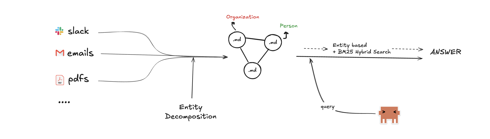

# ⚛ Oregon

<p align="center">
  
</p>

### Solving context fragmentation

Every organization has the same problem: the answer to any business question is scattered across a dozen systems — HR platforms, emails, CRMs, chat logs, ticketing tools, code repos, policy docs. Asking "What's the status on client X?" shouldn't require knowing which of 15 data sources to check, how to join records across them, or which conversation from last week overrides the one from last month.

The real world makes this worse. There's no shared schema. People are referenced by name in emails but by ID in the CRM. A client status change lives in a Slack message, not the database. And some questions simply can't be answered from the data — the system should know that too, and tell you who to ask instead.

**Oregon is a knowledge graph that turns raw enterprise data into a navigable web of markdown pages — one per entity, linked like Wikipedia.** An LLM agent answers questions by searching, reading, and following links across the graph, the same way a person would browse an internal wiki.

Under the hood:

- **Graph-based markdown knowledge base** — every entity (person, client, product, ticket) gets a living page that stays current as new data flows in
- **Reverse index for bidirectional traversal** — backlinks are always up to date, so the agent can navigate in any direction
- **Organization-oriented ontology** — entity types and relationships mirror how businesses actually think (people, clients, vendors, products), not how databases store rows
- **Time-aware sequential processing** — communications are ingested chronologically; newer state overrides older state, so "postponed" in 2021 supersedes "on track" in 2020
- **Fidelity tiers** — structured sources (HR, CRM) become authoritative anchor pages; low-fidelity sources (emails, chats) enrich those pages but don't get their own entities, and remain searchable via BM25 + hybrid retrieval
- **Intelligent human-in-the-loop** — when the data can't answer a question, the system generates open-ended follow-up questions and suggests specific people to ask *(backend/frontend integration for this flow is not yet fully stitched together)*

### Known limitations

- **Partial time awareness** — the test corpus (EnterpriseBench) spans 2016–2022; in a production system, date-relative queries ("last quarter", "recently") would need grounding to the current date

---

## Quickstart

```bash
cp .env.example .env        # fill in at least GOOGLE_API_KEY
docker compose up --build    # → backend :3000, voice-agent :8001, frontend :4321
```

On first boot the backend ingests the EnterpriseBench dataset into `./data/` — this takes a while. Subsequent starts skip ingestion if `./data/` already has content.

| Service | URL |
|---|---|
| Frontend | [http://localhost:4321](http://localhost:4321) |
| Backend API | [http://localhost:3000](http://localhost:3000) |
| Voice Agent | [http://localhost:8001](http://localhost:8001) |
